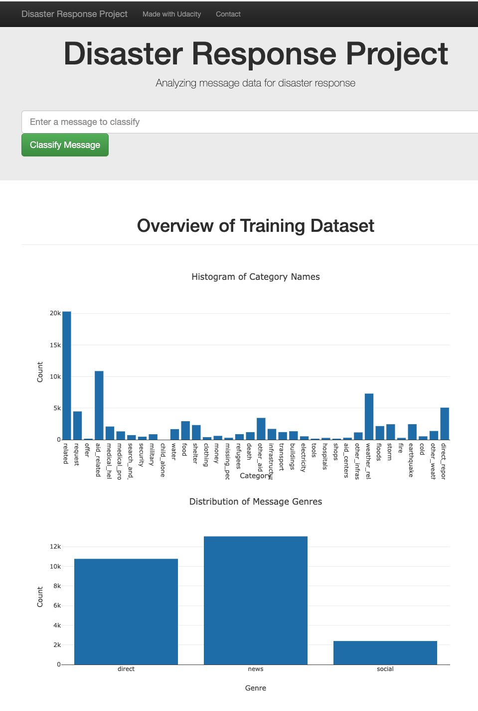
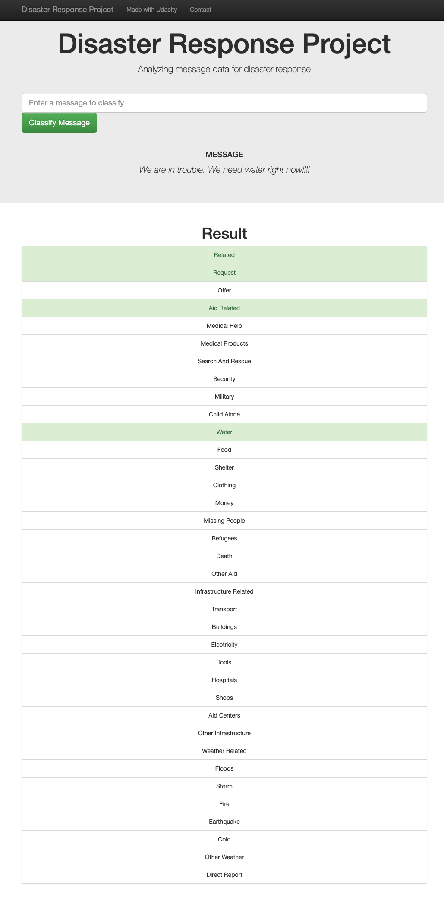

# Disaster Reponse Pipeline
A Web app that classifies messages from disaster areas using ML.

The model is trained on data from [Figure Eight](https://appen.com/).

The user can input the query via an app. The classified categories would be marked in green.


### Home Page



### Results Page


### Run Model
* Run Training: `python src/train_classifier.py data/DisasterResponse.db data/response_model.pkl`
* Run App: `python run.py`

### General Flow
* `src/process_data.py` is responsible for the data cleaning.
  * Load and merge data from csv files
  * Clean the target column and parse it into 36 binary target categories
  * Store the output in an SQLite DB 
* `src/train_classifier.py` is responsible for the nlp processing and model training.
  * Load the data from the SQLite DB
  * Split the data into a train and test set
  * Build a pipeline that parses the messages
  * Train using Grid Search
  * Evaluate the model using test sets
  * Save the model
* Finally, run the app, upload the model, and start playing with it!

### File Structure
 ```
├── data                    <- Raw and processed data. Where the model lives (was too big to upload) 
├── docs                    <- Documents and images for the README.md file 
├── src                     <- Where all of the testable python source code lives
├── templates               <- Frontend files
├── tests                   <- Tests for the python source code
├── LICENSE                 <- License and terms of use
├── README.md               <- That's me!
├── requirements.txt        <- The dependency file to reproduce the environment
├── run.py                  <- run script
└── setup.py                <- File to help setup the environment locally, on an IDE.
```


### Acknowledgements
I want to express my thanks to [Figure Eight](https://appen.com/) for the data and [Udacity](https://udacity.com) for the review and advice.

[Github Repo](https://github.com/LesterFreamon/disaster_response_pipeline)
